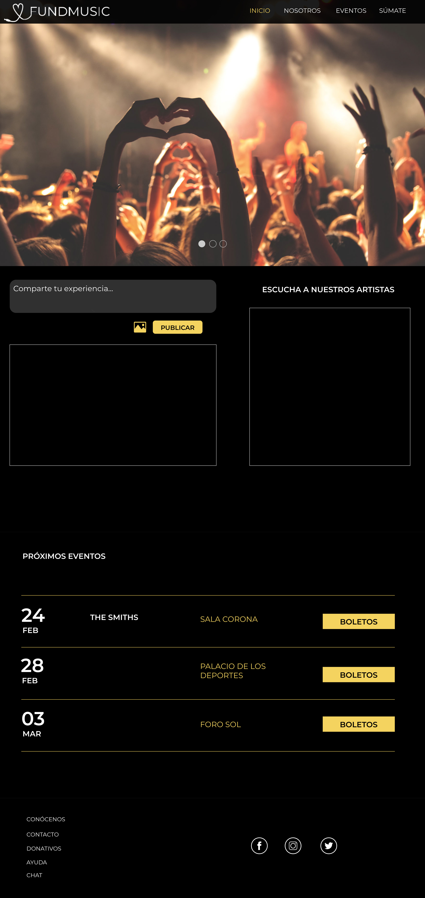

#FundMusic

## FundMusic es una plataforma digital dedicada a apoyar fundaciones con causa por medio de conciertos de beneficencia.

#### La idea surgió a partir de impulsar el talento mexicano a abrirse paso en el ambito músical y recibir reconocimiento. Y para ésto FundMusic planteó que la mejor manera de lograrlo era creando una plataforma digital en la que tanto bandas, como fundaciones, pudieran resgistrarse para participar en este proyecto y obtener un beneficio mutuo. Ofreciendo también un espacio en el que los usuarios pudieran compartir sus experiencias y sus fotos, además de que pudieran escuchar un poco de la música que cada banda tocaría en sus conciertos y de ésta manera engancharlos a comprar sus boletos.

1. Para desarrollar este proyecto hemos realizado un cronograma con el plan de trabajo y un research para nuestros 3 diferentes perfiles: usuarios, bandas y fundaciones.

**Links de research:**

USUARIOS:
https://es.surveymonkey.com/r/2J9TMPS

BANDAS:
https://es.surveymonkey.com/r/2NC59JY

FUNDACIONES:
https://es.surveymonkey.com/r/25PPXP3

2.- A partir de que el proyecto fue del gusto de éstos tres perfiles, hemos desarrollado la arquitectura de la información.

3.- Depues, hemos creado el mockup con cinco diferentes vistas.

** Primer vista (Home):**

En esta vista se muestra un carousel con diferentes imagenes promocionales, tambien el usuario podrá compartir sus experiencias por medio de una imagen y un texto. Posteriormente el usuario podrá visualizar nuestros próximos eventos y tener la facilidad de adquirir boletos.
Y por último el usuario podrá encontrar una sección de contacto y redes sociales.

** Segunda vista (NOSOTROS):**

* En esta vista el usuraio podrá conocer más sobre la iniciativa de FundMusic y su visión.
Y por último el usuraio podrá encontrar una sección de contacto y redes sociales.

** Tercera vista (Eventos): **

* En esta tercer vista el usuraio podrá visualizar los conciertos que hay deacuerdo a fecha y lugar con una imagen o flyer de la banda.
Y por último el usuraio podrá encontrar una sección de contacto y redes sociales.

** Cuarta vista (Sumate):**

* En esta vista las bandas podrán resgistrarse por medio de un botón principal que direcciona a un formulario, y que al completarlo te regresa a la misma vista para que pueda seguir visualizando a las bandas participantes.
Y por último la banda podrá encontrar una sección de contacto y redes sociales.

** Quinta vista (Sumate, Bandas, Fundaciones): **

* En esta vista las fundaciones podrán resgistrarse por medio de un botón principal que direcciona a un formulario, y que al completarlo te regresa a la misma vista para que pueda seguir visualizando a las fundaciones participantes.
Y por último la fundación podrá encontrar una sección de contacto y redes sociales.

<<<<<<< HEAD
4.- Por último, realizamos un testing en el cúal se han definido la siguiente paleta de colores para plasmarlo en su primer diseño de interfaz.

**Paleta de colores**

**Primer diseño**

=======

## WIREFRAME

## PALETA DE COLORES

>>>>>>> fb1f81b895a4255f95c7517339bae06a88aa369c
